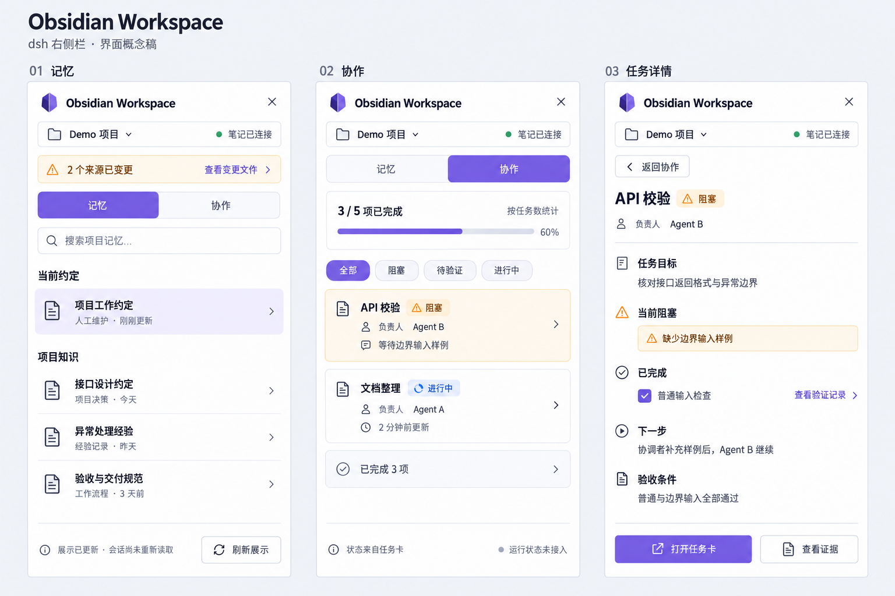
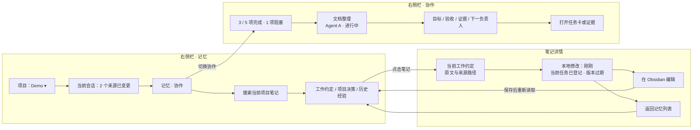
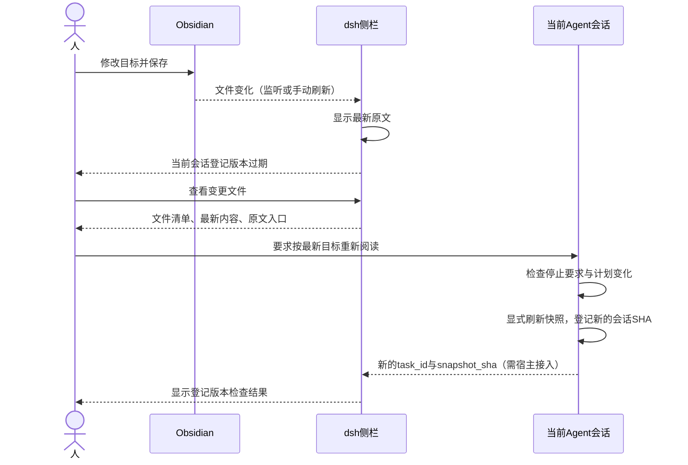
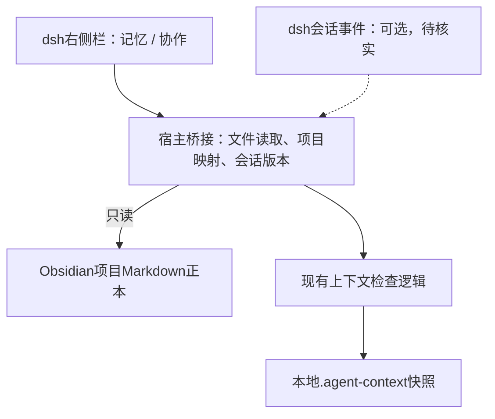

> 实现进度（2026-09-19）：v0.2 已实现 dsh 本地受限读取、默认手动、可选页面可见时 60 秒刷新、手动刷新、项目选择和显式会话 SHA 回执检查。打开 Obsidian、逐文件变化列表、运行事件及派发仍是设计。实际字段为 status/owner；实现与验收以 [使用说明](../sidebar/README.md) 为准。

# dsh 插件方案：Obsidian Workspace

状态：原始产品设计稿，部分已由 v0.2 实现。右侧栏、当前会话 ID 与认证读取接口已核实；下文保留未来能力的设计，不代表全部完成。

## 1. 产品定位

在 dsh 右侧栏随时回答三件事：**项目记住了什么、当前会话登记的是哪一版、各 Agent 的任务推进到哪里。**

Obsidian 继续承载可人工编辑的正本，插件将已有笔记、任务与证据聚合成视图。第一版以查看为主，编辑跳转 Obsidian；不在两个应用中维护两套记忆，不引入独立项目管理数据库。

## 2. 侧栏结构

建议默认宽 380px，可拖动至 320–520px；这些是布局建议，须由 dsh 实际侧栏能力确认。窄侧栏使用纵向列表与详情页，避免横向看板。

顶部固定：插件名、项目选择器、笔记连接状态。项目优先关联当前会话工作目录；映射不唯一时让用户选择，不猜测最近使用的项目。绑定信息保存在宿主本地配置，不提交仓库。

顶部第二行只显示当前会话的上下文状态；主体两个页签：**记忆 / 协作**。详情在侧栏内部打开，顶部提供返回；中间 dsh 会话区保留。

### 记忆页签

| 区域 | 内容 | 点击行为 |
|---|---|---|
| 当前工作约定 | context.md 的标题、短摘录、修改时间 | 打开原文详情 |
| 项目知识 | index.md 中明确链接的 Markdown 来源 | 查看原文；不默认扫描整个私人 Vault |
| 搜索 | 当前项目已发现笔记的标题和正文 | 过滤列表；空结果明确显示 |
| 会话登记范围 | 本任务快照登记的来源数及变更文件数 | 查看来源列表及版本状态 |
| 笔记详情 | 原文、位置、修改时间、是否被当前任务登记 | 在 Obsidian 编辑；若宿主支持则在 dsh 打开 |

记忆卡片短摘录用第一段有效正文，不调用模型生成摘要。保留“普通资料”与“人工工作约定”的类型，不把资料中的文字提升成 Agent 系统指令。

不显示虚假的“已学习”“永久记住”：快照能证明登记版本，不证明 Agent 理解了内容。

### 协作页签

| 区域 | 内容 | 点击行为 |
|---|---|---|
| 项目概览 | 已完成 / 未取消任务总数，进行中、待验证、阻塞数 | 按状态过滤 |
| 任务列表 | 任务名、负责人、任务记录状态、最近更新时间 | 查看任务详情 |
| 任务详情 | 目标、范围、依赖、验收条件、证据、交接与下一负责人 | 打开任务卡、打开证据 |
| Agent 信息 | 任务卡记录的协调者和执行者 | 按负责人过滤 |
| 运行状态（可选） | 宿主确有事件时才显示运行中/等待输入/已结束 | 宿主支持时定位对应会话 |

“任务进行中”是任务卡记录，不等于进程正在运行。无法取得运行事件时显示“运行状态未接入”，不能用文件 mtime 伪造心跳。每个状态旁都能看到来源和更新时间。

进度使用“3 / 5 项已完成”，分母为排除 cancelled 后的任务数；它衡量任务数量，不代表工作量或工时。不允许模型猜百分比。planned、active、blocked、review 都计入未完成；全部取消时显示“无有效任务”，不用 100%。

默认先展示阻塞和待验证任务，再显示进行中；完成与取消可折叠。每张任务卡单独读取，不建立需要多 Agent 共同改写的总看板文件。

## 3. 简单原型交互图



视觉稿展示同一侧栏的三个状态，不是三个同时展开的面板；为静态设计稿，尚未接入 dsh。

下图为结构原型，节点表示可点击入口；内容为虚构演示，非 dsh 真实截图。



**原型画面 A：记忆总览**

| 固定区域 | 示例呈现 |
|---|---|
| 标题栏 | Obsidian Workspace · Demo ▾ |
| 状态条 | 当前会话有 2 个来源已变更 · 查看变更文件 |
| 页签 | **记忆**　协作 |
| 搜索框 | 搜索项目记忆… |
| 第一项 | 当前工作约定 · 人工维护 · 刚刚更新 |
| 第二项 | 接口约定 · 项目知识 · 今天更新 |
| 第三项 | 历史决策 · 项目知识 · 昨天更新 |
| 底部 | 已连接笔记目录 · 刷新展示 |

**原型画面 B：协作总览**

| 固定区域 | 示例呈现 |
|---|---|
| 标题栏 | Obsidian Workspace · Demo ▾ |
| 页签 | 记忆　**协作** |
| 进度摘要 | 3 / 5 项完成（按任务数） |
| 筛选 | 全部 · 阻塞 · 待验证 · 进行中 |
| 任务一 | API 校验 · 阻塞 · Agent B · 等待测试输入 |
| 任务二 | 文档整理 · 进行中 · Agent A · 任务卡 2 分钟前更新 |
| 折叠区 | 已完成 3 项 |
| 底部 | 状态来自任务卡 · 运行状态未接入 |

**原型画面 C：任务详情**

| 区域 | 示例呈现 |
|---|---|
| 顶部 | 返回协作 · API 校验 |
| 状态 | 阻塞 · 负责人 Agent B |
| 目标 | 核对接口返回格式 |
| 依赖 | 缺少边界输入样例 |
| 已完成 | 普通输入检查，证据链接 |
| 下一步 | 协调者补充样例后，Agent B 继续 |
| 操作 | 打开任务卡 · 打开证据 |

第一版不提供“标记完成”“重新派发”“终止 Agent”按钮；没有可靠宿主能力和验收契约时，这些按钮会把展示层变成另一套执行系统。

## 4. 人工修改与会话更新



两个动作必须分开：

- **刷新展示**：重新读盘，只改变视图，不执行 capture、不替换会话 SHA。
- **更新会话上下文**：Agent 阅读并处理目标变化后才刷新。宿主未提供会话桥接时，只展示“复制重新读取指令”，不能显示“已更新 Agent”。

现有快照只保存路径与哈希，所以第一版按钮叫“查看变更文件”，不叫“查看逐行差异”。逐行 diff 需要另外可获取的历史正文，后续如接入 Git/Obsidian 历史再增加，不能凭哈希还原旧内容。

当前会话状态：未绑定任务、未登记版本、版本一致、来源已变化、文件缺失/不可读。缺少该会话的已读 SHA 时显示“未登记”，不能读取最新共享快照的 SHA 冒充会话已读版本。

## 5. 数据如何从现有项目接入

| 能力 | 现有情况 | 插件所需增量 |
|---|---|---|
| 可编辑的长期记忆 | index.md、context.md、主题笔记 | 本地读取、Markdown 展示与链接解析 |
| 上下文版本 | capture/read/check 与每会话 SHA | 复用检查逻辑，增加结构化输出；禁止解析终端中文提示作为协议 |
| 多 Agent 任务 | Markdown 任务卡；目前状态/负责人写在正文 | 定义稳定的可选任务 Frontmatter 字段；兼容旧卡只读 |
| 项目进度 | 无汇总器 | 读取各任务卡即时聚合，不保存第二份台账 |
| Agent 实时状态 | 本项目没有 | dsh 宿主能力待核实；不可从任务卡推断 |
| 实际会话绑定 | CLI不存会话注册表 | dsh 本地保存 session_id → project/task_id/已读 SHA |

建议新任务卡的最小机器字段（**仅设计，不批量迁移当前模板**）：

```yaml
---
type: project-task
project: demo
status: active
coordinator: agent-main
assignees: [agent-a, agent-b]
---
```

文件名仍是任务 ID。目标、范围、阻塞原因、验收、交接放正文；更新时间来自文件系统，标注为“本地文件更新时间”，不当成事件发生时间。进度只依赖明确的 status，负责人来自 assignees；正文中的类似文字不参与机器推断。

旧卡缺结构化字段时：仍可打开原文，状态显示“未结构化”，并单列“另有 N 项状态未知”；有未知任务时将统计称为“已识别任务 3/5”，不得声称覆盖整个项目。需要迁移时人工确认映射；字段与正文冲突显示提示，不自动修正文案。

只识别 type=project-task 的任务；模板、空文件、解析错误单列说明，不能计作完成。Markdown 渲染禁脚本与危险 HTML；路径按允许根目录解析，防止通过软链或链接打开未授权文件。

## 6. 技术接入方案



优先在宿主进程内复用文件访问与监听；监听不可用时提供手动刷新。无需先建立 HTTP 服务。UI 不直接访问任意系统路径，配置根目录由宿主授权；打开 Obsidian 的 URI/文件能力需按宿主实际支持实现，并正确编码路径。

桥接层的概念操作：listProjects、listNotes、readNote、listTasks、inspectContext、openSource。它们是本文的职责划分，**不是已验证的 dsh SDK 方法名**。第一版无需对外插件服务总线或数据库。

后续实现可给现有 CLI 增加 `--json` 或只读 inspect 操作，输出机器可解析的 task_id、snapshot_sha、来源变更清单、错误类型；复用现有校验，不重写一套 SHA 语义。运行子进程时用参数数组，不拼接 shell 字符串。

项目切换时清空旧详情、筛选与异步读取结果；重新绑定根目录和会话映射，防止旧项目结果迟到后显示到新项目。数据读取失败时保留内容必须标注“上次读取”，不能继续显示绿色最新状态。

## 7. MVP 与后续边界

| 第一版必做 | 后续有宿主能力再做 |
|---|---|
| 项目目录绑定、记忆列表与原文、任务列表与详情 | 跳转指定 Agent 会话 |
| 任务状态/负责人筛选、明确分母的任务计数 | 真实运行事件和等待输入提示 |
| 会话版本未登记/过期/一致的准确展示 | 向当前会话发送重新读取请求 |
| 文件更新提示、手动刷新、原文编辑入口 | 有历史正文时的逐行差异 |
| 未结构化、缺失、断连和空状态 | 经另行授权的任务派发或编辑 |

MVP 不做自动记忆摘要、自动改写笔记、自动接管任务、跨设备锁、自动把任务标成已验证。

## 8. 验收场景

1. 未绑定项目：显示选择目录，不扫描整个 Vault。
2. 打开原文：笔记列表进入详情，再跳转正确的 Obsidian 项目笔记。
3. 人工修改概览：侧栏展示新内容，当前会话仍显示过期，不能自动变绿。
4. 另一 Agent 刷新共享快照：旧会话依然过期，只有重新登记其已读版本才解除。
5. 任务统计：5 个未取消任务中 3 个 done，则显示 3/5；取消任务不计入；未知状态单列。
6. 卡为 active 但没有运行事件：显示“任务进行中 / 运行状态未接入”，不能显示在线心跳。
7. 字段缺失/正文矛盾：保留原文入口，显示状态未知或冲突，不猜测。
8. 源文件删除或连接中断：显示缺失/不可读，不当作任务取消或知识已遗忘。
9. 仅点击刷新展示：Vault 字节、共享快照、当前会话登记 SHA 均不改变。
10. 切换项目：不混入旧项目笔记、任务或版本状态；空列表可理解，键盘可操作页签与返回。

## 9. 需要核实的 dsh 宿主能力

右侧栏注册与生命周期、UI 技术栈和主题、当前项目/会话标识、本地文件权限、文件监听、打开文件/外部 URI、会话事件与消息桥接、插件打包与安装机制。

已核实并采用 React 侧栏注册、会话 ID 和 Connection 认证读取；其余能力按实际需要继续核实。
