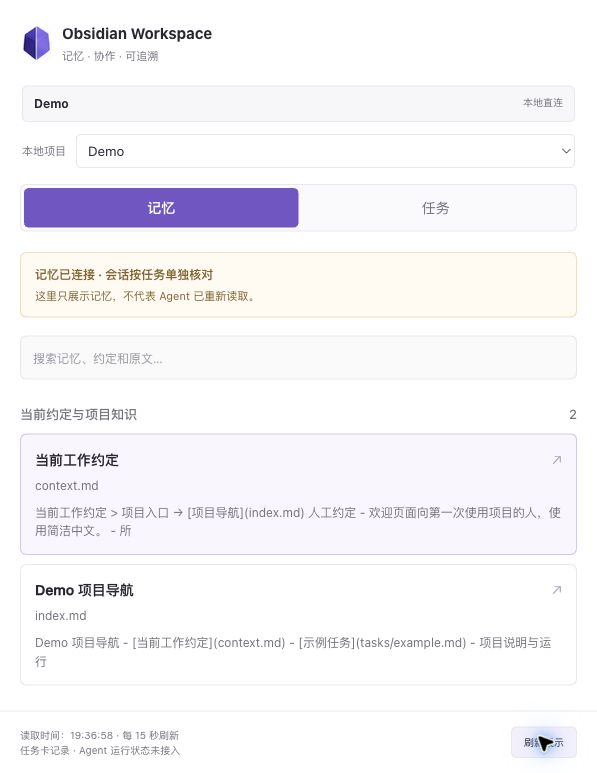

# 发布候选 · v0.3.0-alpha.1

本轮干净源码构建、依赖审计与独立安装包验证见 [发布检查](release-readiness.md)。本轮通过既有本地 link 安装更新前端至发布候选并刷新页面；设置增删改、目录切换及侧栏同步已完成真实浏览器验收。发现的 HTML pattern 连字符转义问题已修复。快速切换项目可能触发 429，手动刷新可恢复，详见发布检查。

# 当前安装：v0.3 · 2026-09-19

- 新增 dsh 设置 → Obsidian 项目，加载已有连接，编辑名称/笔记目录/可选仓库目录，新增、移除、保存和重新加载。
- 真实宿主已显示设置入口与现有连接表单。认证 HTTP 接口已实测新增、修改、Demo 读取和移除验证连接；最终保留原有配置。
- 写入需要登录、同源 Host/Origin 和 JSON；重复 ID、相对路径、缺失目录、旧配置修订拒绝保存。临时文件原子替换配置，不写项目目录。
- 保存通知当前页面侧栏重新加载配置；其他页面重新打开侧栏。网络超时会提示重新加载确认结果。
- 浏览器中保存验收遭遇宿主连接等待，后续浏览器控制超时；不将接口验证冒充完整浏览器保存交互验收。设置页视觉入口已验证，完整增删改浏览器流程待复验。

以下为此前版本验收：

# 当前安装：v0.2.1 · 2026-09-19

- 默认关闭自动刷新；首次选择项目读取一次，提供手动刷新及每 60 秒自动刷新开关。重开侧栏回到手动模式。
- Chrome / dsh 0.1.5-rc.2 实测：手动读取时间更新、开关状态切换、满 60 秒自动更新，最终恢复关闭。正式验证时段没有新增控制台错误或页面错误覆盖层。
- 本机已连接用户指定的实际项目；只读导入成功，模板不计入任务，缺少状态的任务显示未标记。未把真实笔记、导出正文或私人截图写入本仓库。原文哈希前后相同。
- 修复任务模板及非标准文件名使整个导出失败的问题。type: project-task-template 作为参考笔记展示；不放宽会话快照 ID 校验。
- Python 17 项、Node 5 项、预览打包 4 项测试通过；普通构建、插件构建及打包通过。刷新测试覆盖关闭、定时器清理、隐藏页面跳过及重复请求跳过。
- 已有项目的旧版快照协议未迁移；侧栏未创建会话回执，不能把导入当作 Agent 已读。窄屏未重新验收。

以下保留 v0.2 的历史验收记录（15 秒是旧行为）：

# 本机安装验证 · 2026-09-19

- dsh 0.1.5-rc.2，Web profile；插件 dsh-obsidian-workspace 0.2.0，link 到 sidebar/dist/plugin，已加入 bundles。
- 已重启宿主，保留认证设置；未发送模型消息。只连接仓库 Demo，未连接 Stock 或私人 Vault。
- Chrome 真实侧栏自动读盘：Demo、2 篇笔记、1 个 planned 任务，负责人 Coordinator，进度 0/1。当前宿主会话显示“会话未读取”，未伪造回执。
- 修改 Demo context.md 标题后，未点击刷新，15 秒轮询展示新标题；随后恢复原文。
- 临时使本地连接配置无效：点击刷新后标明“读取失败 · 旧数据”，保留先前内容；恢复配置并刷新后恢复“本地直连”。
- 用 SHA-256 比较测试前后的 examples 全部文件：原文、快照与回执集合及字节一致。展示刷新不产生会话回执。
- 未认证接口返回 401；非本站 Origin 返回 403。插件复用 Connection 的认证，不绕过宿主防护。直接地址导航不是接口调用方式。
- Python 16 项测试、Node 4 项测试、独立预览打包 4 项测试通过；普通构建与插件构建通过。
- 截图仅截取插件，未包含宿主旧会话正文：

会话回执测试在临时目录覆盖：显式读取、人工修改导致过期、其它会话刷新共享快照后旧回执仍过期、失败不写回执及非法会话 ID。

浏览器验收初期多个 dsh 页面造成请求等待；清理本轮重复页后正常。未修改用户原有标签或认证权限。旧版文件选择自动化的权限阻挡未宣称已修复；v0.2 本地连接无需该文件选择流程。

仍未接入：真实 Agent 运行事件、任务派发、自动记忆注入、Obsidian 跳转。热重载、全宿主 CSS 与窄屏视觉保真未验收；当前截图与交互仅代表桌面侧栏。
